# Trader Journal

Локальный журнал сделок с уклоном в **ICT / SMC**: вести позиции вручную или подтягивать из **MT5**, следить за риском, собирать статистику и не терять контекст (плейбуки, killzones, bias, дневник дня). Всё работает **на твоей машине** — без облачного аккаунта и без отправки сделок разработчику и без ведения скрытой статистики.

---

## Что внутри

- **Сделки** — открытые и закрытые, pips, %, плавающий P/L по live-ценам (крипта и часть FX через публичные потоки, без API-ключей).
- **Риск и Проверка при сохранении** — лимиты из профиля, дневной стоп, серии, cooldown, чек-лист из заметок, правила выбранного сценария из плейбука; жёсткие блоки и мягкие предупреждения с возможностью осознанно продолжить.
- **Плейбуки** — стратегии, сетапы (plays), killzones, требования по HTF, условия входа; можно опереться на готовую ICT-базу или собрать свою.
- **Статистика** — привычные метрики, equity, heatmap’ы, разрезы по bias и дисциплине.
- **Аналитика** — отдельная вкладка: маяки состояния, дорожная карта и текстовые ориентиры из **локального** корпуса (без нейросетей и без утечки данных наружу).
- **Справочник** — Сводка лимитов из профиля, журнала и справочных таблиц. Теплокарта — вероятность встретить серию убытков в периоде из 50 сделок и другое.
- **Журнал дня и глоссарий** — дневник по датам, настроение, чек-листы; энциклопедия терминов со своими скриншотами.
- **Темы** — светлая, «бумажная», тёмная и неоновая палитра.
- **Импорт / экспорт** — отчёты MT5 (HTML), полный ZIP с глоссарием и картинками, или только JSON сделок.


---

## Данные и приватность

Хранилище по умолчанию — **локально** (в браузере или в профиле десктопного окна). Сеть нужна только для получения актуальных цен. **Шифрования базы нет**: кто имеет доступ к твоему ПК — имеет доступ и к данным приложения(доработка в следующей версии). Экспорты и чужие файлы импорта открывай осознанно.

---

## Как запустить

**Готовые сборки** (без Node): в [Releases на GitHub](https://github.com/Skifak/JTrade/releases) можно скачать **HTML**.

**Для сборки из исходников** нужен **Node.js 18+** в каталоге проекта:

```bash
npm install
npm run dev
```

Дев-сервер с HMR. Сборка `dist`, preview и Tauri — в [корневом README](trader-journal/README.md).

---

## Фото журнала

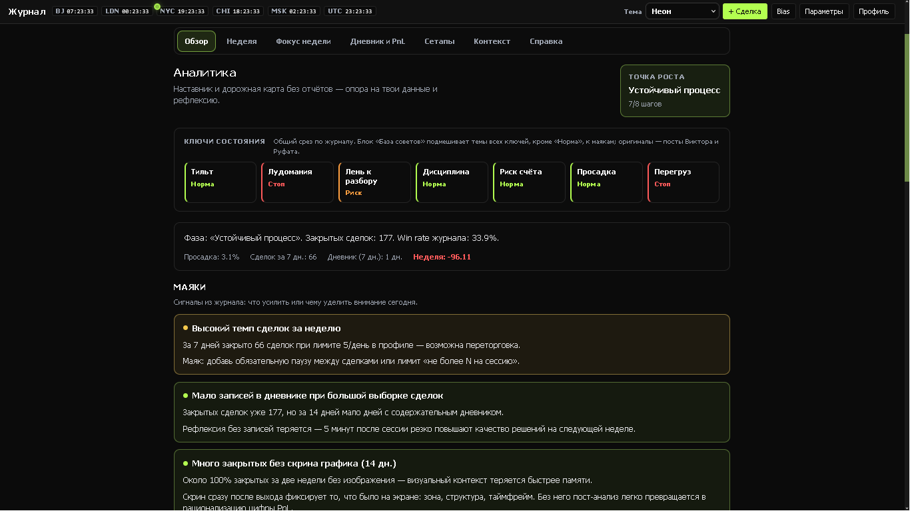
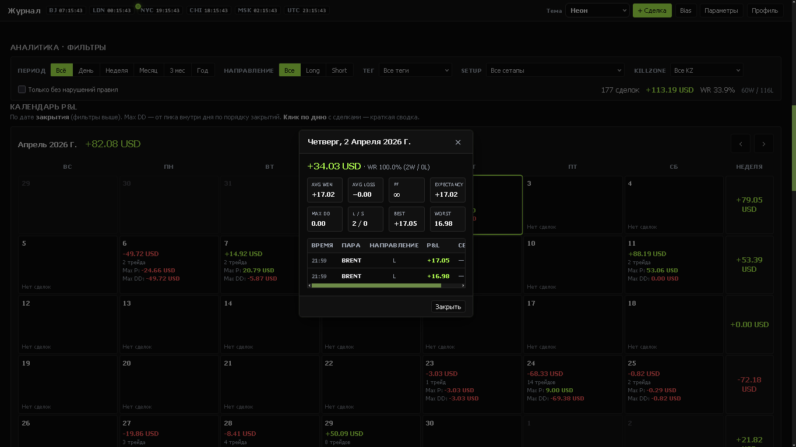
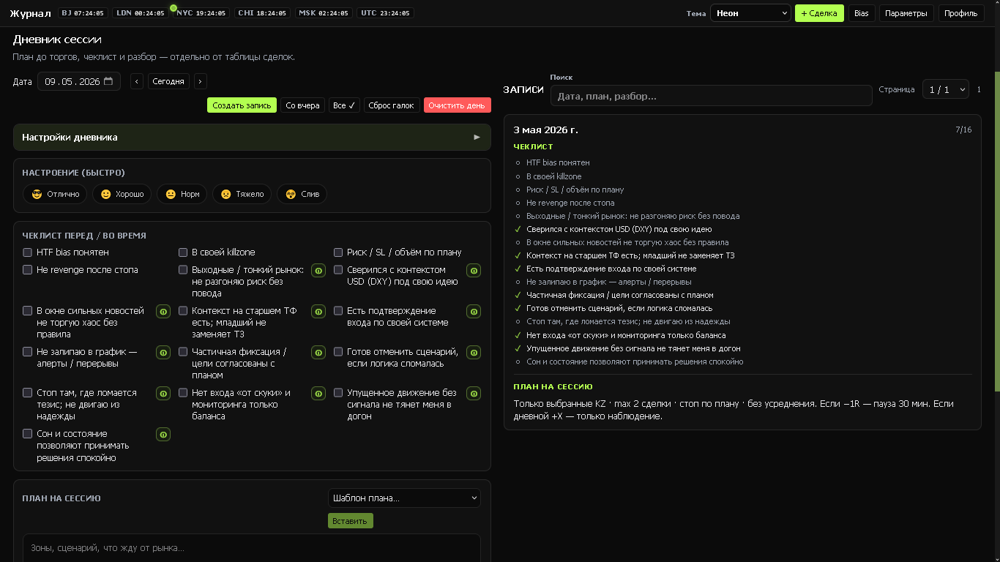
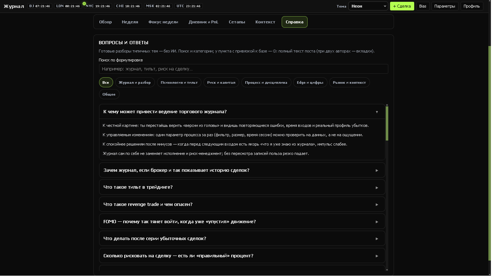
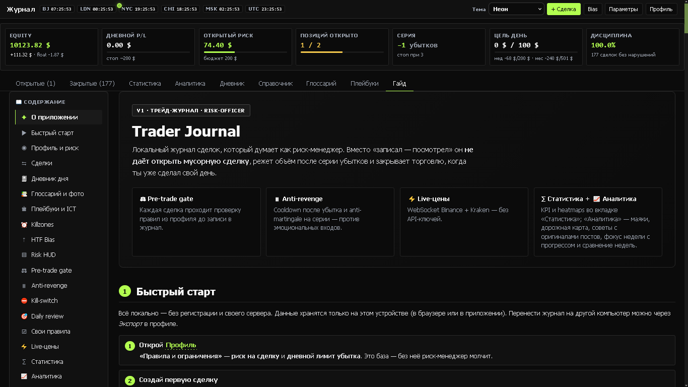
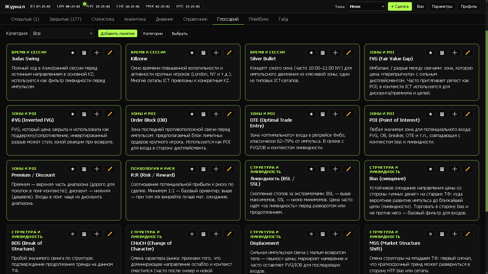
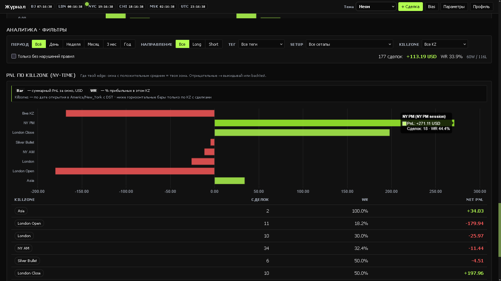
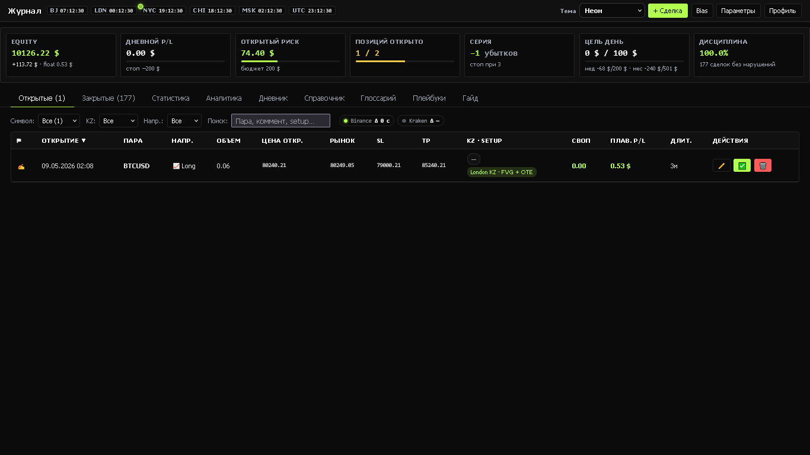
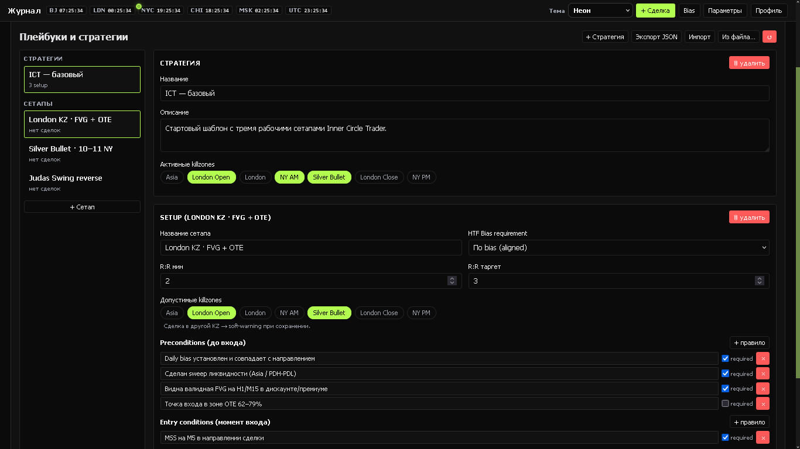
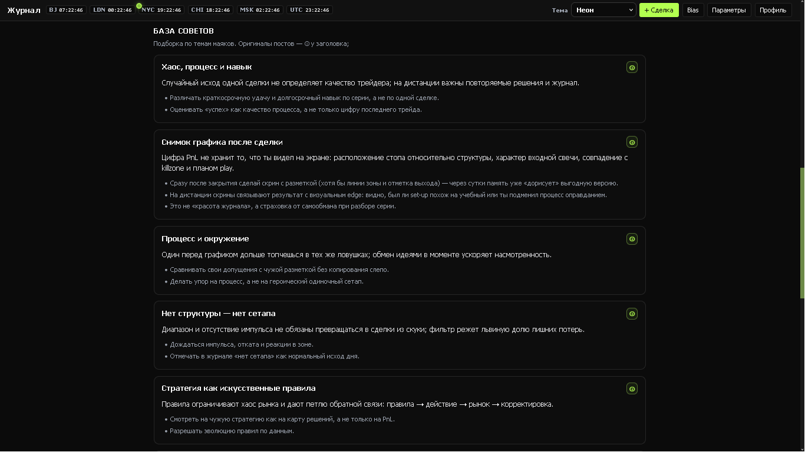
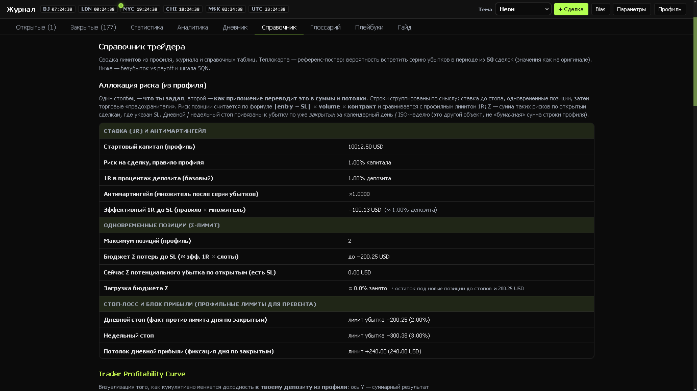

## Лицензия

Проект для личного использования.
